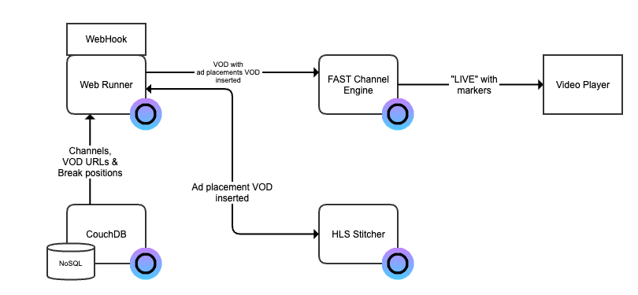

# FAST Channel Setup

This document describes the Eyevinn Open Source Cloud setup for FAST channels with ad placement opportunities for Il Globo TV.

Demo channel available here: https://ilglobotv.ce.prod.osaas.io/channels/demo/master.m3u8

## Architecture in Eyevinn Open Source Cloud

### Database

A NoSQL database based on open web service [CouchDB](https://docs.osaas.io/osaas.wiki/Service%3A-CouchDB.html) is created. It contains one database called `channels`. Each channel contains a list of assets and every asset includes the URL to the VOD and a list of ad placement opportunities.

### WebHook as Web Runner

To provide custom logic to the FAST Channel Engine we provide a webhook `/nextVod` that the channel requests when a new VOD is to be played. This repository contains the code for this webhook. The webhook is deployed using the open web service [Web Runner](https://docs.osaas.io/osaas.wiki/Service%3A-Web-Runner.html).

Before a URL to the VOD is returned to the engine the webhook uses the HLS stitcher to dynamically generate a VOD where the ad placement VODs are inserted. This modified VOD is then passed to the engine.

The WebHook is deployed to a WebRunner by providing the URL to the GitHub repository containing this code and a GitHub token.

### FAST Channel Engine

We create a channel instance of type `WebHook` where we point to the `/nextVod` endpoint. The name of the instance is added as a query parameter `?channelId` and used by the webhook to lookup the channel in the database. As the VODs are demuxed we set the Demuxed audio option as enabled.

To modify the contents of the channel update the database and to add more channels add a new channel in the database. Then create a new channel instance with the name of the channel.